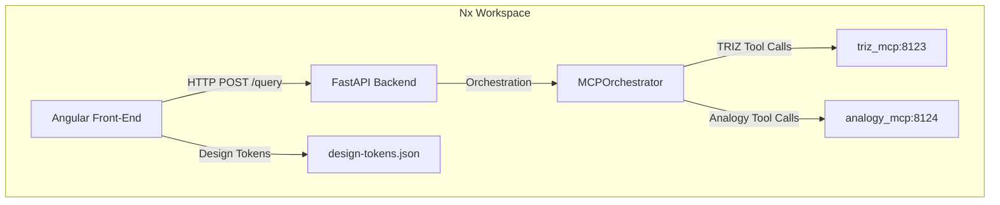

# Technology Stack Overview

**Project:** *SeGn* – Hackathon 2026

---

## 📦 Monorepo Management – Nx

- **Nx** is the workspace orchestrator that powers the monorepo. It provides:
  - Incremental build caching and task graph optimization.
  - Consistent linting, testing and code‑generation across all packages.
  - Implicit dependencies between the **frontend** and **backend** projects.
  - Built‑in support for Docker and CI pipelines via custom executors.

The central `nx.json` defines the two primary apps (`frontend` → Angular, `backend` → FastAPI) and a `docker` target used by CI.

---

## 🐳 Containerisation – Docker

All services are containerised for reproducible development and deployment:
1. **frontend** – Angular SPA built with `ng build` and served by an `nginx:alpine` image.
2. **backend** – FastAPI application running under `uvicorn` inside a `python:3.13‑slim` image.
3. **optional database** – PostgreSQL (included in `docker‑compose.yml` for local testing).

Docker Compose (`docker-compose.yml`) pulls the images together, exposing:
- `http://localhost:4200` → Angular UI
- `http://localhost:8000` → FastAPI JSON API

---

## 🎨 Design System – Design Tokens

The file `src/styles/design-tokens.json` is the single source of truth for colours, typography and spacing. Tokens are consumed by:
- **Angular** via global styles in `styles.css` converting tokens into CSS custom properties (variables) and importing the Poppins font.
- **FastAPI** documentation (Swagger UI) to keep the API UI aligned with the app theme.

```json
{
  "color": {
    "background": {
      "primary": { "$type": "color", "$value": "#F7F8F4" }
    }
  },
  "font": {
    "family": { "base": { "$type": "fontFamily", "$value": "Poppins" } }
  }
}
```

---

## 🖥️ Front‑End – Angular

- **Framework:** Angular 21 (standalone components, strictly typed).
- **Styling:** CSS Custom Properties + design‑tokens for a unified visual language.
- **Routing:** Lazy‑loaded features via Angular Router.
- **Build:** Executed through Nx (`nx build my-hackathon-app`), output placed in `dist/` and baked into the Docker image.

---

## 🛡️ Back‑End – Python FastAPI + MCP Orchestrator

- **Framework:** FastAPI – async‑first, auto‑generates OpenAPI docs.
- **Orchestration:** **MCPOrchestrator** – coordinates problem analysis, contradiction formulation, candidate generation, and evaluation matrix scoring.
- **Core Logic:** Python modules under `my-hackathon-app/apps/src/backend/`.
- **Dependencies:** Managed with `uv` (using `pyproject.toml` and `uv.lock`). Main packages:
  - `fastapi`, `uvicorn`, `pydantic`, `fastmcp`, `httpx`, `openai`.
- **MCP Endpoints:**
  - `http://localhost:8123/mcp` → TRIZ MCP Server
  - `http://localhost:8124/mcp` → Analogy MCP Server

---

## 🔧 Build & CI/CD Pipeline

1. **Pre‑commit:** `nx lint` (ESLint for Angular) + formatters.
2. **CI (GitHub Actions):**
   - Set up Node & Python.
   - Run lints and tests.
   - Build Docker images and push to the artifact registry.
   - Deploy to a staging environment with Docker Compose.
3. **CD:** Automatic promotion on tag push (`v*`).

---

## 📈 Architecture Diagram



---

## 📚 Useful Commands

- **Nx**: `nx run-many --target=build --all`
- **FastAPI**: `uv run uvicorn backend.main:app --reload --port 8000`
- **Angular**: `npx nx serve my-hackathon-app`

---

*Prepared by Antigravity – your AI‑powered coding assistant.*
