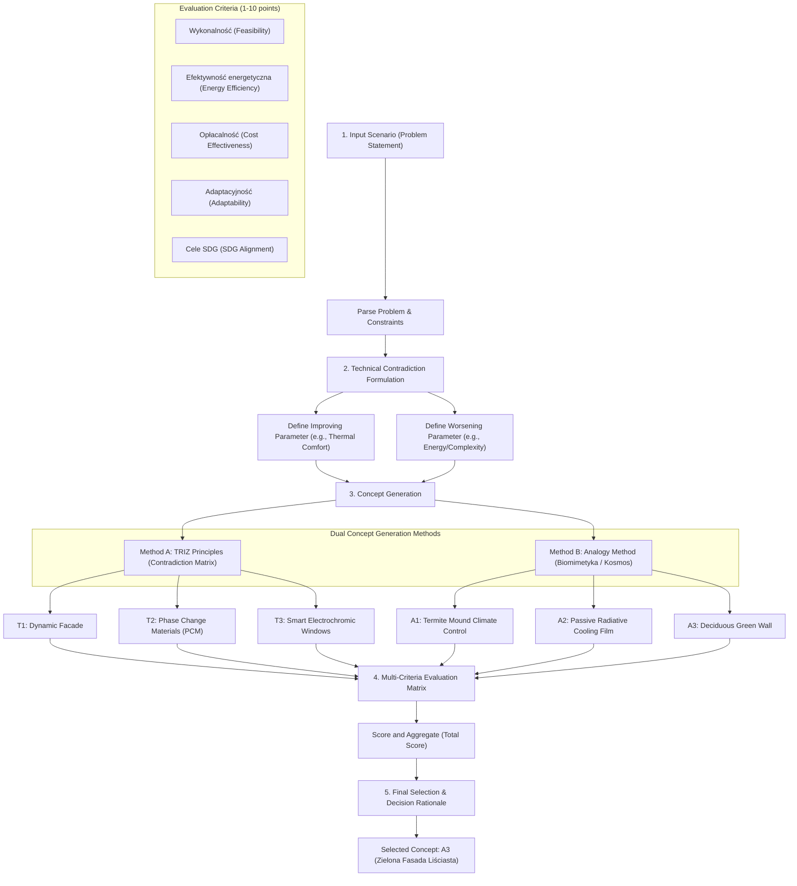

# R&D Inventive Problem Evaluation & Decision Report

This report documents the systematic evaluation process implemented in the **SeGn R&D Orchestrator**, detailing the path from input scenario ingestion to contradiction formulation, dual-method candidate generation, multi-criteria scoring, and final selection.

---

## 1. Evaluation Pipeline Flow

The following diagram illustrates the flow of information through the evaluation system:

---

## 2. Evaluation Steps Description

### Step 1: Input Scenario Ingestion
The system ingests unstructured text describing an inventive challenge (for example, **Problem 7: Keeping Buildings Hot & Cold** targeting UN SDGs 11 & 13). The input defines strict boundary parameters (e.g., zero active AC, low-energy dependency, and dual-season adaptivity).

### Step 2: Technical Contradiction Formulation
Based on the input parameters, the orchestrator formulates the technical contradiction:
* **Improving Parameter**: Thermal stability and indoor comfort (maintaining a target temperature).
* **Worsening Parameter**: Energy usage, system complexity, and waste heat generation.
* **Contradiction Formula**: *If we increase static insulation to keep the building warm in winter, then it traps heat in summer, necessitating active AC and increasing energy consumption.*

### Step 3: Concept Generation (Dual Methods)
To ensure algorithmic breadth, the system generates candidate solutions using two separate methods (at least 3 solutions each):
1. **Method A: TRIZ (Theory of Inventive Problem Solving)**: Looks up contradiction matrix parameters to extract inventive principles (e.g., *Zasada 15 - Dynamizm*, *Zasada 35 - Zmiana stanu fizykochemicznego*).
2. **Method B: Analogy Method**: Extracts concepts from non-standard domain matches, such as biological systems (biomimicry) or aerospace systems (passive heat rejection).

### Step 4: Multi-Criteria Evaluation Matrix
All 6 generated concepts are evaluated against five key R&D criteria, scored on a scale of 1 to 10:
* **Feasibility (Wykonalność)**: Simplicity of installation, material availability, and structural compatibility.
* **Energy Efficiency (Efektywność energetyczna)**: Level of reliance on external electricity grids (target: 0 active power).
* **Cost-Effectiveness (Opłacalność)**: Initial capital expenditure and maintenance lifecycle costs.
* **Adaptability (Adaptacyjność)**: How well the solution autonomously transitions from winter warming to summer cooling.
* **SDG Alignment (Zgodnosc z celami SDG)**: Direct contribution to SDG 11 (Sustainable Cities) and SDG 13 (Climate Action), and elimination of active AC heat rejection.

### Step 5: Final Selection & Decision Rationale
The orchestrator aggregates the scores and identifies the winning concept (highest total score). The system outputs a transparent justification outlining why the winner is optimal, how it complies with constraints, and the next steps for validation.

---

## 3. Metrics Summary Table

| Metric/Criteria | Target Goal | Score Range | Description |
| :--- | :--- | :--- | :--- |
| **Feasibility** | High structural compatibility | 1 - 10 | Ease of construction and integration with current building standards. |
| **Energy Efficiency** | Zero active grid load | 1 - 10 | Passive operation; no heavy electrical components. |
| **Cost-Effectiveness** | Low investment/maintenance | 1 - 10 | Financial viability for developers and building operators. |
| **Adaptability** | Autonomous dual-season shift | 1 - 10 | Ability to change thermal resistance or solar transmission passively. |
| **SDG Alignment** | High environmental benefit | 1 - 10 | Passive greenhouse gas reduction and zero urban heat island penalty (No AC). |

---

*Prepared by Antigravity R&D Orchestration Services.*
